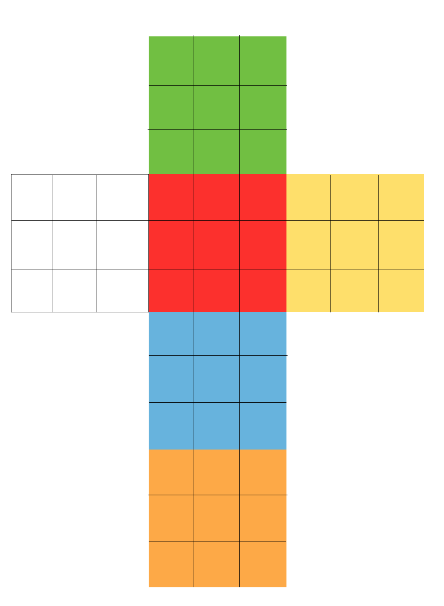

rubik
=====

Right now a simple virtual rubik's cube represented by a multidemensional array.
The cube is represented as if it were cut and unfolded, shown in the
illustration below:

Moves have been added so that you can rotate the cube on any side in each
direction. The cube can be moved by inputing an array of moves into
cube.move(array_of_moves_here). The array cosists an array of strings such
that:

u = up
d = down
b = back
f = front
l = left
r = right

and an addition of an apostophe indicates that the moves should be done
counterclockwise, otherwise it is clockwise.

so "f" would be a clockwise rotation of the front face and "d'" would be a
counterclockwise rotation on the down face. The cube map will of course update
the array that stores the state of the cube.

cube
-----
cube.possibleMoves returns an array of strings with all of the possible moves such as 'u' and "d'"
cube.map returns an array of each row of the map of the cube. Each color is represented by a number as follows:
- Empty = 0
- Green = 1
- Red = 2
- Blue = 3
- Orange = 4
- Yellow = 5
- White = 6

cube.move() is a function which takes an array of moves as an argument and executes all the moves in the arrya.

cube.getEdges() returns the edges. First the edges on the top face, then the edges in the middle slice of the cube, then finally the edges on the bottom (going clockwise starting with the edge on the back of the cube.
cube.getCorners() return the corners of the top and bottom face going clockwise starting from the top left.

moves
----
moves contains all the moves that a 3x3 can undergo. A move is prefexied with 'c' or 'cc' if it is clockwise or counterclockwise respectively. Then it is suffixed with the side that is being rotated (ie Top, Left, etc...)
cube.move takes in an array of strings representing the moves and preforms the respective action. If a move inputted is not a valid move it will return "Move not valid.

tests
----
tests.colors is a dictionary which relates the number of the color and a character representing the color, useful when testing and printing the state of the cube.
tests also contains a suite of functions that can print each side of the cube as well as the cube in its entirety.
tests.testAllMoves() is a function useful when testing if all the moves are working properly as it uses all of the moves and prints the state of the cube after every move.
