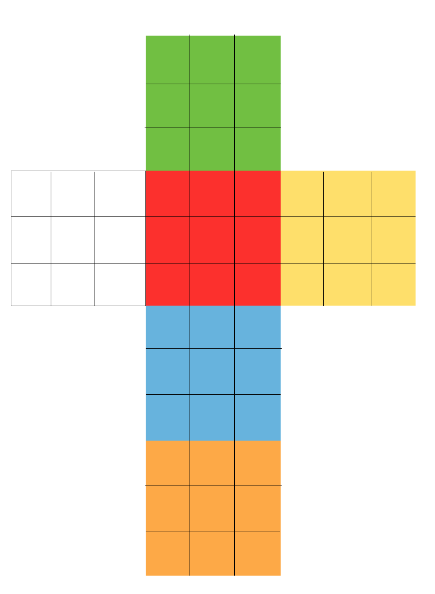

rubik
=====

Right now a simple virtual rubik's cube represented by a multidemensional array.
The cube is represented as if it were cut and unfolded, shown in the
illustration below:

Moves have been added so that you can rotate the cube on any side in each
direction. The cube can be moved by inputing an array of moves into
cube.move(array_of_moves_here). The array cosists an array of strings such
that:

u = up
d = down
b = back
f = front
l = left
r = right

and an addition of an apostophe indicates that the moves should be done
counterclockwise, otherwise it is clockwise.

so "f" would be a clockwise rotation of the front face and "d'" would be a
counterclockwise rotation on the down face. The cube map will of course update
the array that stores the state of the cube.
